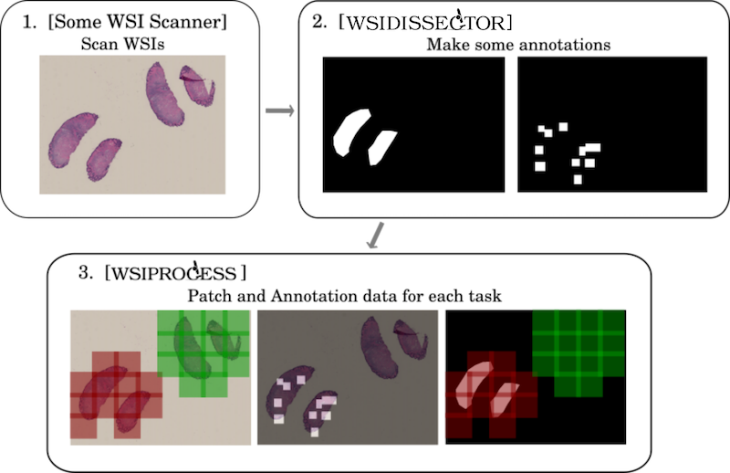

Convert Helper for Histopathological / Cytopathological Machine Learning Tasks

# Main Flow

<div style="text-align: center"></div>

1. Scan some WSIs.
2. Make some annotations with WSI annotation tools
3. Then wsiprocess helps converting WSI + Annotation data into patches and easy-to-use annotation data.

[WSIPatcher](https://github.com/tand826/WSIPatcher) will give you GUI.
[Command Helper](https://tand826.github.io/wsiprocess_command_line_helper) will recommend commands to run.

# Installation

1. Install [libvips](https://libvips.github.io/libvips/)

   - Linux - `apt install libvips`
   - MacOS - `brew install vips`
   - Windows - Install tarball from [here](https://github.com/libvips/build-win64)

2. Install wsiprocess
   ```
   pip install wsiprocess
   ```

### Anaconda User

```
# Only for python 3.6 or higher
conda install -c tand826 wsiprocess
```

# Example

### As a python module

#### Basic Usage

```python
import wsiprocess as wp
slide = wp.slide("xxx.tiff")
annotation = wp.annotation("xxx.xml")
rule = wp.rule("xxx.json")

annotation.make_masks(slide, rule, foreground=True)

patcher = wp.patcher(slide, "classification", annotation)
patcher.get_patch_parallel("benign")
```

#### Export annotaton xml of one class as mask image

```python
import wsiprocess as wp
slide = wp.slide("xxx.tiff")
annotation = wp.annotation("xxx.xml")
annotation.make_masks(slide)
annotation.export_mask("xxx/masks", "benign")
```

#### Export annotation xml with inclusion definition as mask images, and save their thumbs

```python
import wsiprocess as wp
slide = wp.slide("xxx.tiff")
annotation = wp.annotation("xxx.xml")
rule = wp.rule("xxx.json")
annotation.make_masks(slide, rule)
annotation.export_thumb_masks("xxx/masks")
```

### As a command line tool

```bash
wsiprocess xxx.tiff method --annotation xxx.xml
```

- Need recommendation for choice of arguments? -> [Command Helper](https://tand826.github.io/wsiprocess_command_line_helper)

### As a docker command line tool

```bash
# build the image
docker build . -t wsiprocess_image

# run the container
docker run --name wsiprocess_container -v [your files directory]:/data -it -d wsiprocess_image [commands] etc.
```

see Command Helper for commands

# Available WSIs

<details>
    <summary>Test ongoing</summary>
    <div>

- From below we tested wsi data.

  - :smile: => worked well.
  - :umbrella: => did not work well.
  - otherwise => did not check

### Classification

- Aperio

  - CMU-1-JP2K-33005.svs
  - :smile: CMU-1-Small-Region.svs
  - :smile: CMU-1.svs
  - CMU-2.svs
  - CMU-3.svs
  - JP2K-33003-1.svs
  - JP2K-33003-2.svs

- Generic-TIFF

  - :umbrella:CMU-1.tiff
    - Can not set magnification.

- Hamamatsu-vms

  - :smile:CMU-1.zip
  - CMU-2.zip
  - CMU-3.zip
    - Could not DOWNLOAD from http://openslide.cs.cmu.edu/download/openslide-testdata/Hamamatsu-vms/

- Hamamatsu

  - :smile:CMU-1.ndpi
  - CMU-2.ndpi
  - CMU-3.ndpi
  - OS-1.ndpi
  - OS-2.ndpi
  - OS-3.ndpi

- Leica

  - :smile:Leica-1.scn
  - Leica-2.scn
  - Leica-3.scn
  - Leica-Fluorescence-1.scn

- Mirax

  - CMU-1-Exported.zip
  - CMU-1-Saved-1_16.zip
  - CMU-1-Saved-1_2.zip
  - :umbrella:CMU-1.zip
    - Can not make the foreground mask.
  - CMU-2.zip
  - CMU-3.zip
  - Mirax2-Fluorescence-1.zip
  - Mirax2-Fluorescence-2.zip
  - Mirax2.2-1.zip
  - Mirax2.2-2.zip
  - Mirax2.2-3.zip
  - Mirax2.2-4-BMP.zip
  - Mirax2.2-4-PNG.zip

- Olympus

  - OS-1.zip
  - OS-2.zip
  - OS-3.zip

- Trestle

  - :umbrella:CMU-1.zip
    - ASAP can not show the image properly, and it's hard to annotate.
  - CMU-2.zip
  - CMU-3.zip

- Ventana

  - OS-1.bif
  - OS-2.bif

- :umbrella:Zeiss : Can not load slide - :umbrella:Zeiss-1-Merged.zvi - :umbrella:Zeiss-1-Stacked.zvi - :umbrella:Zeiss-2-Merged.zvi - :umbrella:Zeiss-2-Stacked.zvi - :umbrella:Zeiss-3-Mosaic.zvi - :umbrella:Zeiss-4-Mosaic.zvi
</div>
</details>

# Test

### Download sample WSI

```
curl -O -C - http://openslide.cs.cmu.edu/download/openslide-testdata/CMU-1.ndpi
```

### Make random annotation

- Install ASAP ( Linux / Windows ) - https://github.com/computationalpathologygroup/ASAP/releases
- Open CMU-1.ndpi and make some random annotation. - Save the annotation xml as "CMU-1.xml".

### Run test.py

```
cd tests
pytest tests.py
```

# Citation

```
@article{wsiprocess,
    Author = {Takumi Ando},
    Title = {WSIPROCESS - Whole Slide Image Processing Library for Histopathological / Cytopathological Machine Learning Tasks},
    Journal = {github.com/tand826/wsiprocess},
    Year = {2019}
}
```

# TODO

- pathology_viewer to be public
- add link to WSIPatcher
- add to conda
- slow free server on heroku
- paste results on the thumbnails
